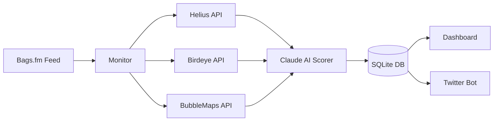

# ScamHound

**AI-powered rug pull early warning system for the Bags.fm Solana token launchpad**

[](https://python.org)
[](LICENSE)
[](https://solana.com)

[Website](https://scamhoundcrypto.com) • [Twitter](https://twitter.com/ScamHoundCrypto) • [GitHub](https://github.com/RunTimeAdmin/ScamHound)

---

## Overview

ScamHound monitors newly launched tokens on Bags.fm and scores them for scam risk using multiple data sources and Claude AI analysis. It helps traders make informed decisions by providing real-time risk assessments before they invest.

### Why ScamHound Matters

Every day, hundreds of new tokens launch on Bags.fm. While most are legitimate projects, some are designed to rug pull unsuspecting traders. Currently, there is no native security layer in the Bags ecosystem to warn traders before they invest in potentially fraudulent tokens.

**ScamHound fills this gap** by providing:
- Real-time monitoring of every new token launch
- Multi-source data aggregation from 4 independent APIs
- AI-powered risk analysis with token-age-aware scoring
- Actionable alerts through a live dashboard

---

## Architecture



**Data Flow:**
1. **Bags.fm Feed** — Polls every 60s for new token launches
2. **Data Enrichment** — Fetches on-chain data from Helius, market data from Birdeye, and cluster analysis from BubbleMaps
3. **AI Scoring** — Claude AI analyzes all data sources and generates risk scores
4. **Storage** — Results persisted to SQLite database
5. **Presentation** — Served via FastAPI dashboard with REST API endpoints

---

## Features

| Feature | Description |
|---------|-------------|
| **Auto-Monitoring** | Polls Bags.fm feed every 60 seconds for new tokens |
| **Manual Scan** | Paste any mint address via dashboard for instant analysis |
| **AI Risk Scoring** | Claude AI analyzes multiple risk factors and returns structured verdicts |
| **Token-Age Awareness** | New tokens aren't auto-flagged for expected patterns (e.g., high concentration in first 10 minutes) |
| **BubbleMaps Integration** | Wallet cluster analysis detects coordinated holder groups |
| **Web Settings** | Configure all API keys through the browser — no file editing required |
| **Embeddable Widget** | Risk badges for token pages |
| **Dark Theme Dashboard** | Real-time scores with auto-refresh |

---

## Quick Start

### Prerequisites

- Python 3.10 or higher
- API keys from: Bags.fm, Helius, Birdeye, BubbleMaps, and Anthropic

### Installation

```bash
# Clone the repository
git clone https://github.com/RunTimeAdmin/ScamHound.git
cd ScamHound

# Install dependencies
pip install -r requirements.txt

# Copy environment template
cp .env.example scamhound/.env
```

### Configuration

**Method 1: Web Settings (Recommended)**
1. Start the application: `cd scamhound && python main.py`
2. Navigate to `http://localhost:8000/settings`
3. Enter your API keys through the browser interface
4. Click Save — keys are stored securely in `config.json`

**Method 2: Environment File**
Edit `scamhound/.env` with your API keys (see table below).

### Running

```bash
cd scamhound
python main.py
```

The application will:
1. Initialize the SQLite database
2. Start the monitoring scheduler (polls every 60 seconds by default)
3. Run an initial scan cycle immediately
4. Start the FastAPI web server on port 8000

Access the dashboard at: **http://localhost:8000**

---

## Configuration

### API Keys Required

| Variable | Service | Purpose | Get Key At |
|----------|---------|---------|------------|
| `HELIUS_API_KEY` | Helius | On-chain Solana RPC, holder analysis | [helius.dev](https://helius.dev) |
| `BAGS_API_KEY` | Bags.fm | Token launch feed, creator profiles | [dev.bags.fm](https://dev.bags.fm) |
| `BIRDEYE_API_KEY` | Birdeye | Market data, liquidity, trade history | [birdeye.so](https://birdeye.so) |
| `BUBBLEMAPS_API_KEY` | BubbleMaps | Wallet cluster analysis, decentralization scoring | [bubblemaps.io](https://bubblemaps.io) |
| `ANTHROPIC_API_KEY` | Anthropic | Claude AI risk scoring | [console.anthropic.com](https://console.anthropic.com) |

### Optional Configuration

| Variable | Default | Description |
|----------|---------|-------------|
| `RISK_ALERT_THRESHOLD` | 65 | Minimum score to trigger high-risk alerts |
| `POLL_INTERVAL_SECONDS` | 60 | Seconds between Bags.fm feed polls |
| `PORT` | 8000 | Dashboard server port |
| `DB_PATH` | scamhound.db | SQLite database file path |

### Configuration Priority

Settings are loaded in this order (later overrides earlier):
1. Default values
2. `.env` file
3. `config.json` (highest priority)

---

## API Endpoints

### Dashboard Routes (HTML)

| Method | Path | Description |
|--------|------|-------------|
| GET | `/` | Main dashboard — shows last 50 scored tokens |
| GET | `/token/{mint}` | Token detail page with full analysis |
| GET | `/widget/{mint}` | Embeddable risk badge |
| GET | `/settings` | API key configuration page |

### API Routes (JSON)

| Method | Path | Description |
|--------|------|-------------|
| GET | `/api/scores` | List recent scores (query: `?limit=50`) |
| GET | `/api/score/{mint}` | Get single token score |
| GET | `/api/stats` | Dashboard statistics |
| POST | `/api/scan` | Manual token scan (`{"mint": "..."}`) |
| POST | `/api/settings` | Save configuration |
| GET | `/health` | Health check for monitoring |

---

## How Scoring Works

### Multi-Source Data Collection

For each token, ScamHound collects:

**From Bags.fm:**
- Token metadata (name, symbol, creation time)
- Creator wallet and username
- Creator royalty percentage
- Claim statistics

**From Helius (On-Chain):**
- Top holder concentration (top 1/5/10 percentages)
- Creator wallet age and transaction history
- Prior token launches from the same wallet
- Wallet clustering analysis (detects coordinated wallets)

**From Birdeye (Market Data):**
- Liquidity and market cap
- Liquidity-to-market-cap ratio
- Unique trader count
- Wash trading indicators
- Large sell pressure detection

**From BubbleMaps (Cluster Analysis):**
- Decentralization score (0-100)
- Number of wallet clusters
- Largest cluster share percentage
- Risk signal classification

### Claude AI Analysis

All data is fed to Claude AI with a specialized system prompt that includes:
- **Token maturity guidelines** — New tokens (< 10 min) aren't penalized for expected patterns
- **Risk factor weighting** — Creator wallet age, prior rug history, and clustering always matter
- **Structured JSON output** — Risk score (0-100), level (LOW/MEDIUM/HIGH/CRITICAL), verdict, risk factors, and safe signals

### Token Age Awareness

| Token Age | Scoring Focus |
|-----------|---------------|
| < 10 minutes | Focus on creator history and wallet clustering; ignore concentration/liquidity |
| 10-60 minutes | Some distribution expected; concentration becomes mild concern |
| > 1 hour | High concentration and low liquidity are genuine red flags |
| > 24 hours | Extreme patterns are severe warnings |

---

## Data Sources

### 1. Bags.fm API
The primary token launch feed. Provides token metadata, creator profiles, and claim statistics.

**Key Data:**
- Token mint, name, symbol, creation time
- Creator wallet address and username
- Creator royalty percentage
- Lifetime trading fees collected

### 2. Helius API
Solana RPC provider for deep on-chain analysis.

**Key Data:**
- `getTokenLargestAccounts` — Top holder distribution
- `getTokenSupply` — Total supply for percentage calculations
- Transaction history for wallet age and prior launches
- Wallet clustering detection via funding source analysis

### 3. Birdeye API
Market data provider for liquidity and trading pattern analysis.

**Key Data:**
- Token overview (price, market cap, liquidity)
- Liquidity-to-market-cap ratio
- Trade history for wash trading detection
- Unique trader count and sell pressure indicators

### 4. BubbleMaps API
Wallet cluster analysis for detecting coordinated holder groups.

**Key Data:**
- **Decentralization Score** (0-100) — Higher is better, indicates distributed ownership
- **Cluster Count** — Number of distinct wallet groups
- **Largest Cluster Share** — Percentage held by the biggest cluster
- **Risk Signal** — Classification: HIGHLY_CENTRALIZED, MODERATE, or DECENTRALIZED

---

## Screenshots

*Screenshots will be added here in a future update.*

---

## Project Structure

```
ScamHound/
├── scamhound/
│   ├── main.py              # Entry point (uvicorn + APScheduler)
│   ├── config.py            # Config loading/saving (config.json/.env)
│   ├── clients/
│   │   ├── bags_client.py       # Bags.fm API client
│   │   ├── birdeye_client.py    # Birdeye API client
│   │   ├── helius_client.py     # Helius API client
│   │   └── bubblemaps_client.py # BubbleMaps API client
│   ├── engine/
│   │   ├── database.py      # SQLite persistence
│   │   ├── monitor.py       # Token scanning pipeline
│   │   └── scorer.py        # Claude AI risk scoring
│   ├── dashboard/
│   │   ├── app.py           # FastAPI routes
│   │   └── templates/       # Jinja2 HTML templates
│   ├── alerts/
│   │   └── twitter_bot.py   # Twitter alert integration
│   └── static/              # CSS, favicons
├── assets/                  # Twitter branding images
├── docs/                    # Documentation
├── requirements.txt
├── .env.example
└── README.md
```

---

## Roadmap

### V2 Planned Features

- [ ] **Twitter Bot Alerts** — Automated high-risk token alerts to @ScamHoundCrypto
- [ ] **Multi-Platform Support** — Extend beyond Bags.fm to other Solana launchpads
- [ ] **Historical Trending** — Track risk scores over time for pattern analysis
- [ ] **Webhook Notifications** — Custom alert endpoints for integrations
- [ ] **Risk Score API** — Public API for third-party integrations

---

## License

MIT License — see [LICENSE](LICENSE) for details.

---

## Credits & Links

- **Website:** [scamhoundcrypto.com](https://scamhoundcrypto.com)
- **Twitter:** [@ScamHoundCrypto](https://twitter.com/ScamHoundCrypto)
- **GitHub:** [github.com/RunTimeAdmin/ScamHound](https://github.com/RunTimeAdmin/ScamHound)

Built with 25+ years of cybersecurity experience applied to the Solana DeFi ecosystem.

---

## Disclaimer

**Not Financial Advice.** ScamHound is provided for educational and informational purposes only. The risk scores and AI-generated verdicts are analytical opinions based on on-chain data patterns and should not be construed as investment advice.

Cryptocurrency trading involves substantial risk of loss. Always conduct your own research (DYOR) before investing. ScamHound does not guarantee the accuracy of its assessments and is not responsible for any financial losses incurred through the use of this tool.

Use at your own risk.
