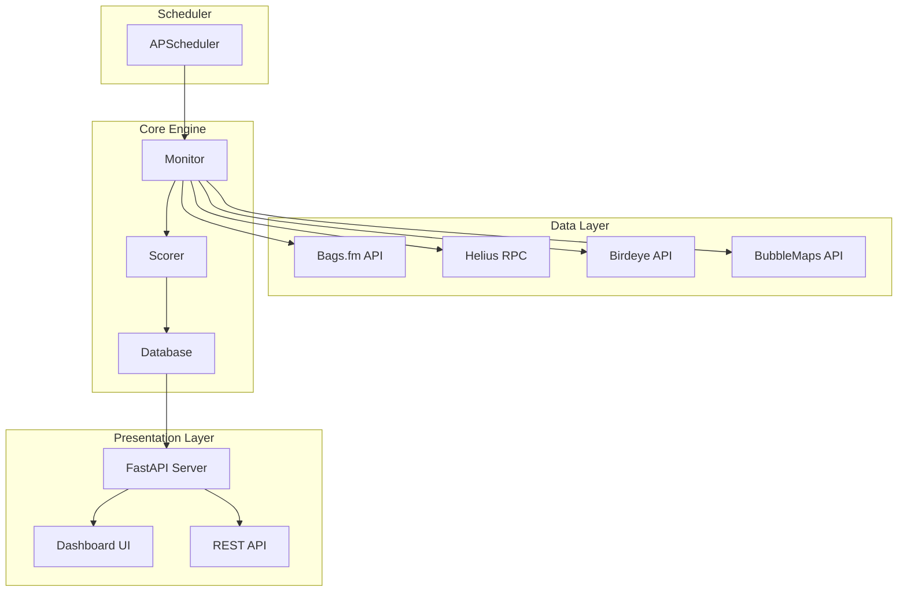
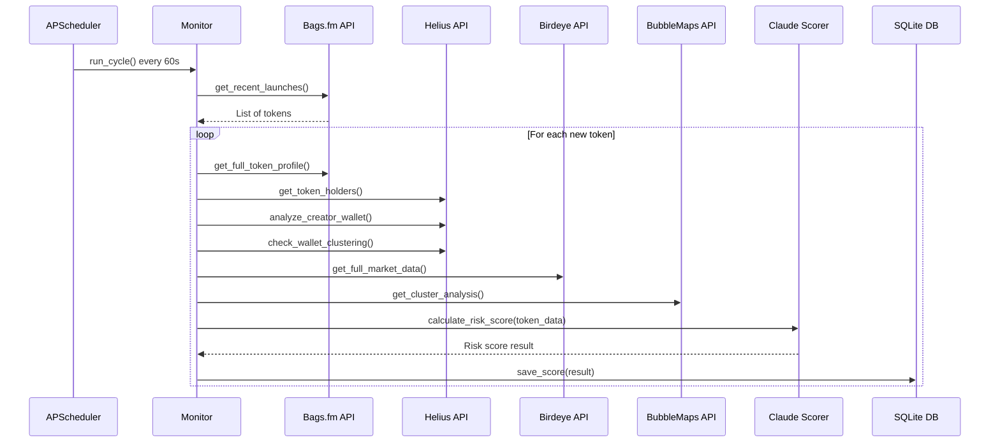
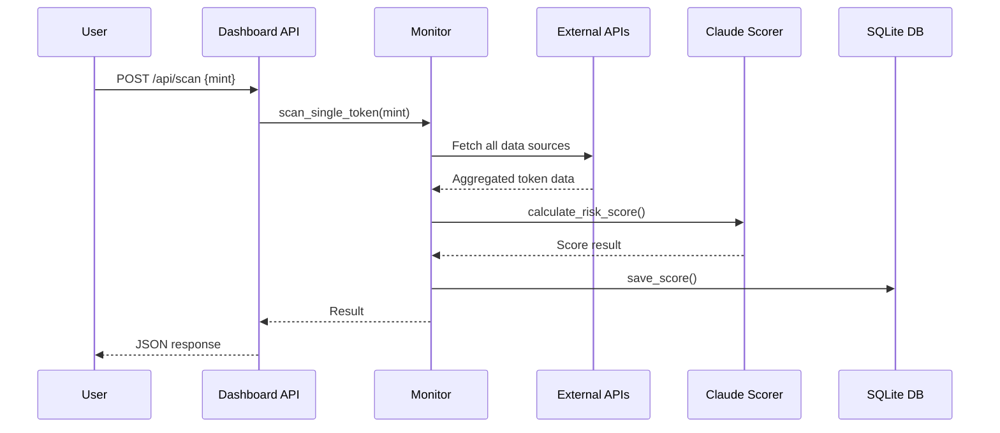

# ScamHound Architecture

This document provides a detailed technical overview of the ScamHound system architecture, component interactions, and data flows.

---

## System Overview

ScamHound is a Python-based application built on FastAPI that monitors Solana token launches on Bags.fm for potential rug pull risks. The system combines data from multiple APIs with Claude AI analysis to generate risk scores.



---

## Component Descriptions

### 1. Main Entry Point (`main.py`)

The application bootstrap that coordinates all components:

- Loads environment variables from `.env`
- Loads configuration from `config.json`
- Initializes SQLite database
- Starts APScheduler for background monitoring
- Runs initial scan cycle in a background thread
- Starts Uvicorn server for FastAPI
- Handles graceful shutdown on SIGINT/SIGTERM

**Key Functions:**
- `main()` — Application entry point
- `signal_handler()` — Graceful shutdown handling

### 2. Configuration Module (`config.py`)

Manages API keys and settings with secure masking:

**Configuration Priority:**
1. Default values (for non-sensitive settings)
2. `.env` file environment variables
3. `config.json` file (highest priority)

**Key Functions:**
- `load_config()` — Loads configuration from all sources
- `save_config()` — Saves settings to `config.json`
- `get_masked_keys()` — Returns masked values (••••last4) for UI display
- `get_config_status()` — Returns boolean status for each key
- `get_raw_config()` — Returns actual values (use with caution)

**Configuration Keys:**
```python
CONFIG_KEYS = [
    "BAGS_API_KEY", "HELIUS_API_KEY", "BIRDEYE_API_KEY",
    "BUBBLEMAPS_API_KEY", "ANTHROPIC_API_KEY",
    "TWITTER_API_KEY", "TWITTER_API_SECRET",
    "TWITTER_ACCESS_TOKEN", "TWITTER_ACCESS_SECRET",
    "TWITTER_BEARER_TOKEN",
    "RISK_ALERT_THRESHOLD", "POLL_INTERVAL_SECONDS"
]
```

### 3. Monitor Module (`engine/monitor.py`)

The core polling and analysis orchestrator:

**Key Functions:**
- `run_cycle()` — Executes one full monitoring cycle
- `scan_single_token()` — Analyzes a single token by mint address
- `_calculate_token_age_minutes()` — Calculates token age from creation timestamp
- `_get_token_status()` — Determines token status (bonding/graduated/active)

**Monitoring Cycle Flow:**
1. Fetch recent launches from Bags.fm (`bags_client.get_recent_launches`)
2. For each new token:
   - Get full Bags profile
   - Calculate token age and status
   - Fetch holder data from Helius
   - Fetch BubbleMaps cluster analysis
   - Analyze creator wallet via Helius
   - Check wallet clustering
   - Fetch market data from Birdeye
   - Calculate risk score via `scorer.calculate_risk_score`
   - Save to database
3. Trigger Twitter alerts for high-risk tokens

**Token Age Filtering:**
- `MIN_TOKEN_AGE_MINUTES` environment variable filters tokens younger than threshold
- Age calculated from `created_at` timestamp

### 4. Scorer Module (`engine/scorer.py`)

Claude AI integration for risk analysis:

**Key Functions:**
- `calculate_risk_score()` — Main scoring function
- `build_user_prompt()` — Constructs the AI prompt with token data
- `_fallback_score()` — Returns default score on API failure

**AI Model:** `claude-sonnet-4-20250514`

**System Prompt Features:**
- Token maturity guidelines (age-aware scoring)
- Risk factor weighting
- Structured JSON output format

**Output Format:**
```json
{
    "risk_score": 0-100,
    "risk_level": "LOW|MEDIUM|HIGH|CRITICAL",
    "verdict": "Plain English explanation",
    "top_risk_factors": ["factor1", "factor2"],
    "top_safe_signals": ["signal1", "signal2"]
}
```

### 5. Database Module (`engine/database.py`)

SQLite persistence layer:

**Key Functions:**
- `init_db()` — Creates `scored_tokens` table
- `save_score()` — Inserts or replaces token score
- `get_recent_scores()` — Returns last N scored tokens
- `get_token_score()` — Returns single token by mint
- `token_already_scored()` — Checks if token exists
- `get_stats()` — Returns dashboard statistics

**Database Schema:**
```sql
CREATE TABLE scored_tokens (
    id INTEGER PRIMARY KEY AUTOINCREMENT,
    token_mint TEXT UNIQUE NOT NULL,
    name TEXT,
    symbol TEXT,
    risk_score INTEGER,
    risk_level TEXT,
    ai_verdict TEXT,
    top_risk_factors TEXT,      -- JSON array
    top_safe_signals TEXT,      -- JSON array
    top_10_concentration REAL,
    creator_wallet TEXT,
    creator_username TEXT,
    prior_launches INTEGER,
    wallet_age_days INTEGER,
    clustering_score REAL,
    liquidity_usd REAL,
    lifetime_fees_sol REAL,
    tweet_sent BOOLEAN DEFAULT FALSE,
    scored_at TIMESTAMP DEFAULT CURRENT_TIMESTAMP,
    created_at TEXT
)
```

### 6. API Clients (`clients/`)

#### Bags Client (`bags_client.py`)
- **Base URL:** `https://public-api-v2.bags.fm/api/v1`
- **Auth:** Header `x-api-key`
- **Key Functions:**
  - `get_recent_launches()` — Feed of recent token launches
  - `get_token_creators()` — Creator wallet and royalty info
  - `get_lifetime_fees()` — Trading fees in SOL
  - `get_token_claim_stats()` — Claim statistics
  - `get_full_token_profile()` — Aggregated token data

#### Helius Client (`helius_client.py`)
- **Base URL:** `https://api.helius.xyz/v0`
- **RPC URL:** `https://mainnet.helius-rpc.com`
- **Auth:** Query param `api-key`
- **Key Functions:**
  - `get_token_holders()` — Uses `getTokenLargestAccounts` RPC
  - `get_wallet_age_days()` — Calculates from oldest transaction
  - `get_previous_token_launches()` — Analyzes token creation history
  - `check_wallet_clustering()` — Detects connected wallets
  - `analyze_creator_wallet()` — Comprehensive wallet analysis

#### Birdeye Client (`birdeye_client.py`)
- **Base URL:** `https://public-api.birdeye.so`
- **Auth:** Header `X-API-KEY`
- **Rate Limiting:** 0.5s minimum between requests, exponential backoff on 429
- **Key Functions:**
  - `get_token_overview()` — Price, market cap, volume
  - `get_liquidity_data()` — Liquidity and ratio calculations
  - `get_trade_history()` — Wash trading and sell pressure detection
  - `get_full_market_data()` — Aggregated market data

#### BubbleMaps Client (`bubblemaps_client.py`)
- **Base URL:** `https://api.bubblemaps.io`
- **Auth:** Header `X-ApiKey`
- **Supported Chains:** eth, base, solana, tron, bsc, apechain, ton, polygon, avalanche, sonic, monad, aptos
- **Key Functions:**
  - `get_map_data()` — Full map with nodes and links
  - `get_cluster_analysis()` — Decentralization score, cluster count
  - `get_holder_connections()` — Relationship data
  - `analyze_token_distribution()` — Comprehensive distribution analysis

### 7. Dashboard (`dashboard/app.py`)

FastAPI web server with Jinja2 templates:

**Routes:**
- `GET /` — Main dashboard (last 50 scores)
- `GET /token/{mint}` — Token detail page
- `GET /widget/{mint}` — Embeddable widget
- `GET /settings` — API key configuration page
- `GET /api/scores` — JSON list of scores
- `GET /api/score/{mint}` — JSON single token
- `GET /api/stats` — Dashboard statistics
- `POST /api/scan` — Manual token scan
- `POST /api/settings` — Save configuration
- `GET /health` — Health check

---

## Data Flow Walkthrough

### Token Discovery (Auto-Polling)



### Manual Token Scan



---

## Database Schema

### scored_tokens Table

| Column | Type | Description |
|--------|------|-------------|
| `id` | INTEGER PRIMARY KEY | Auto-increment ID |
| `token_mint` | TEXT UNIQUE NOT NULL | Solana token mint address |
| `name` | TEXT | Token name |
| `symbol` | TEXT | Token symbol |
| `risk_score` | INTEGER | 0-100 risk score |
| `risk_level` | TEXT | LOW, MEDIUM, HIGH, CRITICAL |
| `ai_verdict` | TEXT | Claude AI explanation |
| `top_risk_factors` | TEXT | JSON array of risk factors |
| `top_safe_signals` | TEXT | JSON array of safe signals |
| `top_10_concentration` | REAL | Top 10 holders percentage |
| `creator_wallet` | TEXT | Creator wallet address |
| `creator_username` | TEXT | Creator username |
| `prior_launches` | INTEGER | Number of prior token launches |
| `wallet_age_days` | INTEGER | Creator wallet age in days |
| `clustering_score` | REAL | 0.0-1.0 wallet clustering score |
| `liquidity_usd` | REAL | Token liquidity in USD |
| `lifetime_fees_sol` | REAL | Trading fees in SOL |
| `tweet_sent` | BOOLEAN | Whether alert was tweeted |
| `scored_at` | TIMESTAMP | When token was scored |
| `created_at` | TEXT | Token creation timestamp |

---

## Configuration Hierarchy

Configuration values are resolved in the following priority order:

```
┌─────────────────────────────────────┐
│  1. Default Values                  │  Lowest Priority
│     (RISK_ALERT_THRESHOLD=65,       │
│      POLL_INTERVAL_SECONDS=60)      │
├─────────────────────────────────────┤
│  2. Environment Variables (.env)    │
│     Loaded via python-dotenv        │
├─────────────────────────────────────┤
│  3. config.json                     │  Highest Priority
│     Saved via web settings page     │
└─────────────────────────────────────┘
```

**Loading Process:**
1. `load_dotenv()` loads `.env` file into environment
2. `load_config()` applies defaults, then overlays `config.json` values
3. All code reads from `os.environ.get()` at request time (not import time)

---

## API Client Error Handling

### Retry Logic

**Birdeye Client:**
```python
max_retries = 3
base_delay = 1.0  # seconds

# Exponential backoff: 1s, 2s, 4s
for attempt in range(max_retries):
    if response.status_code == 429:
        delay = base_delay * (2 ** attempt)
        time.sleep(delay)
```

### Rate Limiting

**Birdeye Client:**
- Minimum 0.5s delay between requests
- Global `_last_request_time` tracker

**Helius Client:**
- Returns `None` on 429 (rate limit) without retry
- Relies on monitor's 1s delay between tokens

### Graceful Degradation

All API clients return `None` on failure, allowing the monitor to continue with partial data:

```python
# Example from monitor.py
try:
    holder_data = helius_client.get_token_holders(token_mint)
    if holder_data:
        token_data["holders"] = holder_data
except Exception as e:
    logger.warning(f"Could not get holder data: {e}")
    # Continue without holder data
```

### Error Patterns

| Client | Error Pattern | Handling |
|--------|--------------|----------|
| Bags | 401 Unauthorized | Log error, return None |
| Helius | 429 Rate Limit | Log warning, return None |
| Helius | RPC Error | Log error, return None |
| Birdeye | 429 Rate Limit | Exponential backoff retry |
| Birdeye | Timeout | Log error, return None |
| BubbleMaps | 401 Unauthorized | Log error, return None |
| Claude | API Error | Return fallback score (50/MEDIUM) |

---

## Security Considerations

1. **API Key Masking:** Settings page only shows masked values (••••last4)
2. **No Key Exposure:** Full keys never returned in API responses
3. **Request-Time Loading:** Keys read at request time, not import time
4. **Local Storage:** `config.json` stored locally, not committed to git
5. **Input Validation:** Mint address format validation on manual scan
